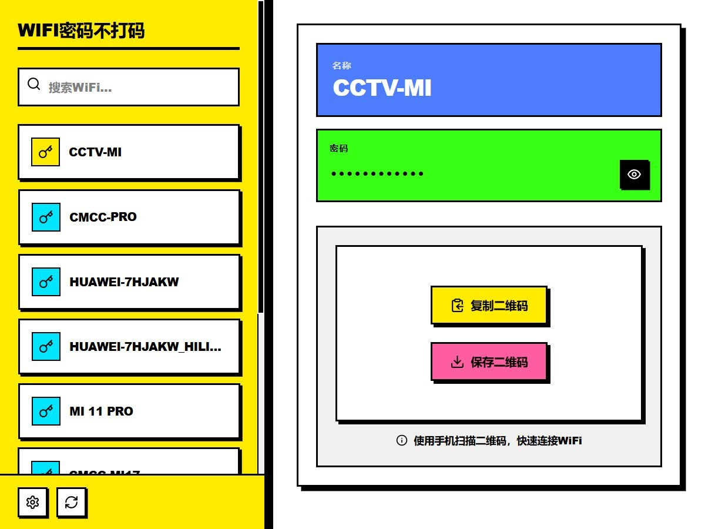
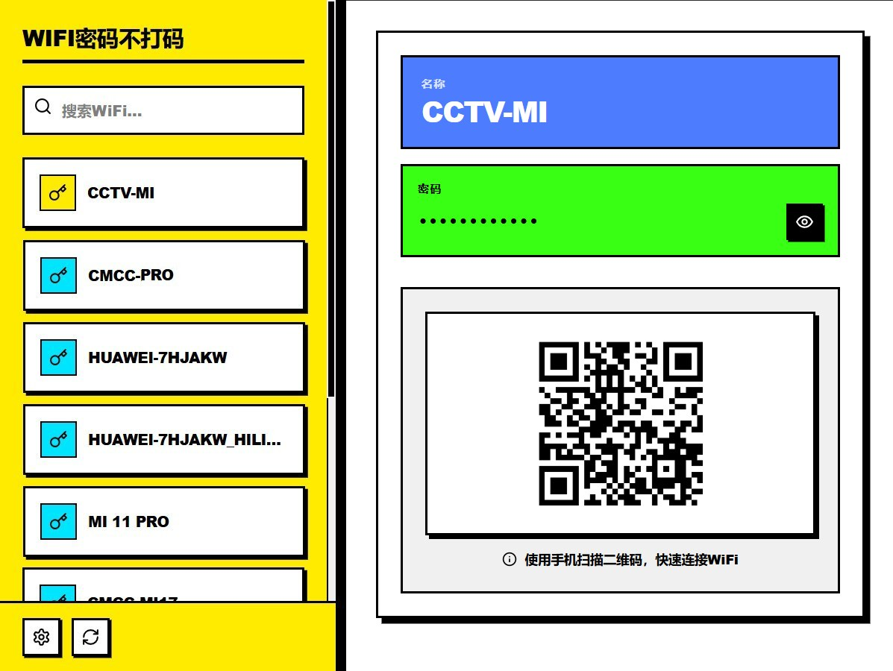
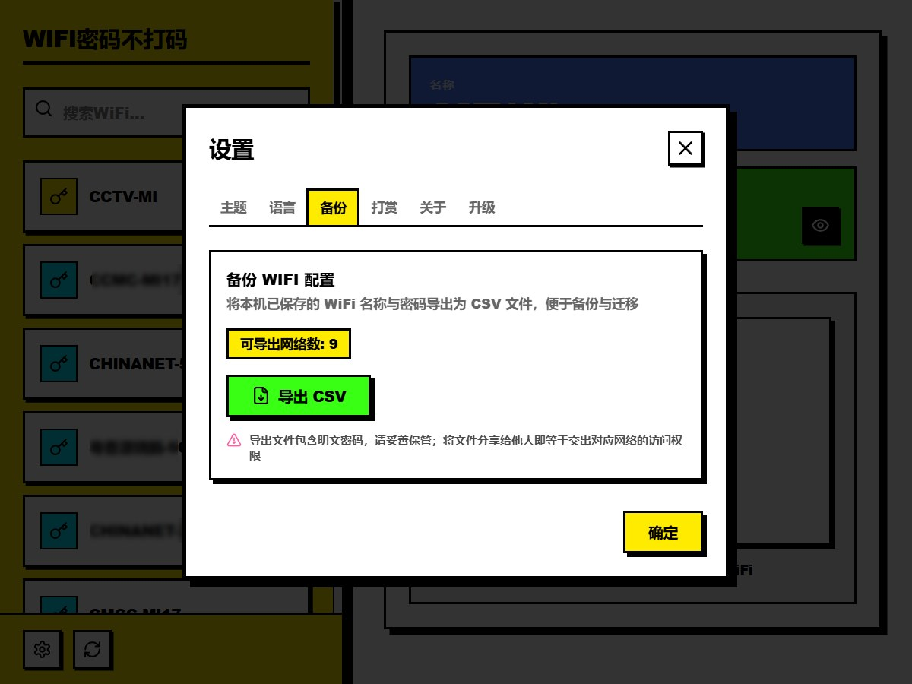

<div align="center">


# PlainWiFi

**A fully-local, open-source, zero-upload Windows tool to view saved WiFi passwords and share them via QR code**

 One-click share QR code

 **English** | [中文](README.zh.md)

</div>

---

## ✨ Features

- **📋 Saved Networks at a Glance**: Lists every WiFi profile saved under the current Windows account (auto-deduplicated; handles multiple wireless adapters / mobile-hotspot scenarios)
- **🔍 Instant Search**: Filter by name; long names are ellipsized with a hover tooltip showing the full SSID
- **👁 Password Show/Hide**: Masked by default; double-click the name card to copy `name + password` to the clipboard
- **📱 Share via QR Code**: Generates standard `WIFI:` payload QR codes (special characters properly escaped; supports WPA/WPA2/WPA3, WEP, open and hidden networks). Point your phone at it and join — no typing. Copy image or save as PNG supported
- **📦 One-Click Backup Export**: Export all saved WiFi profiles (name / password / security type / hidden flag) to a BOM-prefixed CSV that opens cleanly in Excel — generated fully on-device, never touching the network
- **🌓 Dark / Light Theme**: Visual switcher in Settings, preference auto-saved; a "Follow system" option tracks your OS appearance in real time
- **🌐 Bilingual**: Auto-detects your system language; switch anytime in Settings
- **🔄 System Tray**: Keeps running in the tray after closing the window; right-click for quick refresh/restore
- **🚀 In-App Update**: New versions are checked silently at startup; when one is found, a dialog shows the version and release notes and YOU choose Update now / Skip this version / Later. Update packages are minisign signature-verified against tampering; restart with one click after install

## 🔒 Privacy & Security

We know this tool touches sensitive data, so here is our commitment:

| Promise | Details |
|---------|---------|
| **100% Local** | Passwords are read via the built-in Windows `netsh wlan` command — exactly what you'd see in Settings → WLAN → Manage known networks → "Show characters" |
| **Zero Upload** | The app has no server, collects nothing, uploads nothing; network use is limited to updates — one manifest check at startup and downloading the signed update package, with no data ever sent out |
| **Nothing Written to Disk** | WiFi passwords live only in app memory; apart from backup/QR files you explicitly export yourself, only UI preferences are stored locally (theme/language/sidebar width) |
| **No Admin Required** | Only reads profiles the current user is already allowed to view; no privilege escalation attempts |
| **Open for Audit** | Full source code is public — reviews and security feedback welcome |

> ⚠️ Some antivirus products flag "WiFi credential readers" as a category (NirSoft WirelessKeyView gets the same detections). The public source is the proof; false-positive appeals are welcome.

## ⬇️ Download

Get the latest release from [Releases](https://gitee.com/ShiXiongZhiDao/PlainWiFi/releases) (Gitee) or [GitHub Releases](https://github.com/ShiXiongZhiDao/PlainWiFi/releases):

| File | Description |
|------|-------------|
| `PlainWiFi_x.y.z_x64-setup.exe` | NSIS installer (recommended; installer language selectable) |
| `PlainWiFi.exe` | Portable version — unzip and run |

### System Requirements

- Windows 10 22H2 / Windows 11 (x64)
- WebView2 runtime (built into Win11; the installer silently embeds it on Win10 if missing)

## 🚀 Quick Start

1. Launch the app — your saved WiFi list loads automatically
2. Pick a network on the left → the right panel shows name, password (click 👁 to reveal) and a share QR code
3. Point your phone camera at the QR code → "Join Network" pops up automatically
4. ⚙ at the bottom-left opens Settings: Theme / Language / Backup / Update / About


## 截图








## 🛠 Build from Source

```bash
# Prerequisites: Node.js 18+, pnpm, Rust (stable), VS Build Tools
pnpm install
pnpm tauri dev     # development
pnpm tauri build   # release bundle (output: src-tauri/target/release/bundle)
```

Tech stack: Tauri 2 + Vue 3.5 + TypeScript + Tailwind CSS 4 + Vite 6.

## ❓ FAQ

**Q: Why is a network I've connected to missing from the list?**
A: The app only shows profiles visible to the current user account. Networks saved under another user (or elevated context) are not included.

**Q: Can it show passwords for company/campus (802.1X) networks?**
A: No. Enterprise network credentials are managed by the account system and never stored in local WiFi profiles — that's a Windows security guarantee.

**Q: My phone scanned the QR code but nothing happened?**
A: Make sure your scanner supports the `WIFI:` payload (iOS Camera, WeChat, Alipay and mainstream Android browsers all do). Hidden networks are encoded with the `H:true` flag.

**Q: Where is my data stored?**
A: Nowhere. Everything disappears when the app closes; only UI preferences persist locally.

## 📄 License

This project is open-sourced under the [MIT License](LICENSE) — free to use, modify and redistribute (including commercially), provided the copyright notice is retained.

## ☕ Support the Author

If this little tool saved you some time, you can buy the author a coffee — your support keeps the project improving:

| Alipay | WeChat |
|--------|--------|
|  |  |

## 📮 Contact

- Author: 师兄知道 (ShiXiongZhiDao)
- WeChat Official Account: 师兄知道
- Issues & suggestions: welcome in this repository
